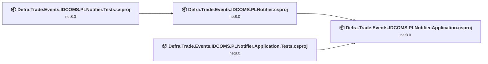
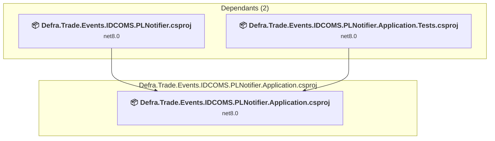
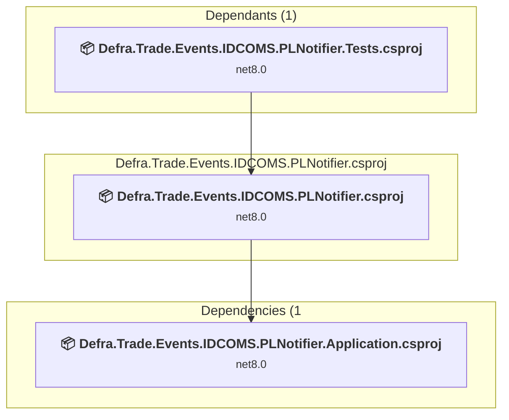
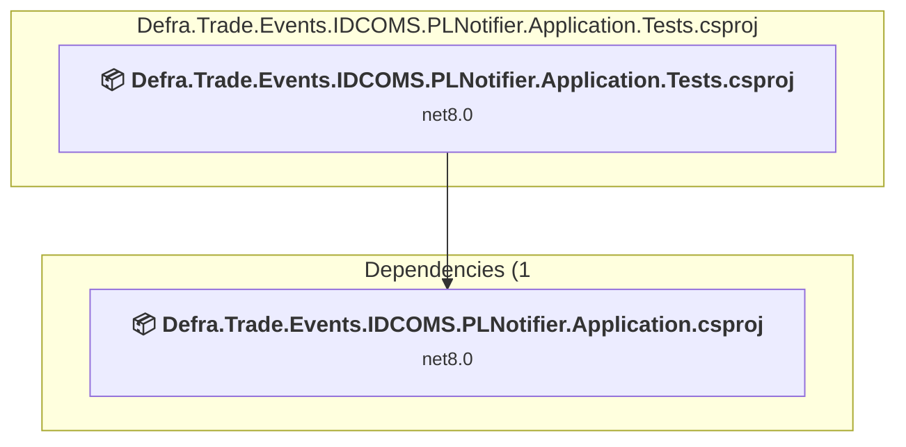
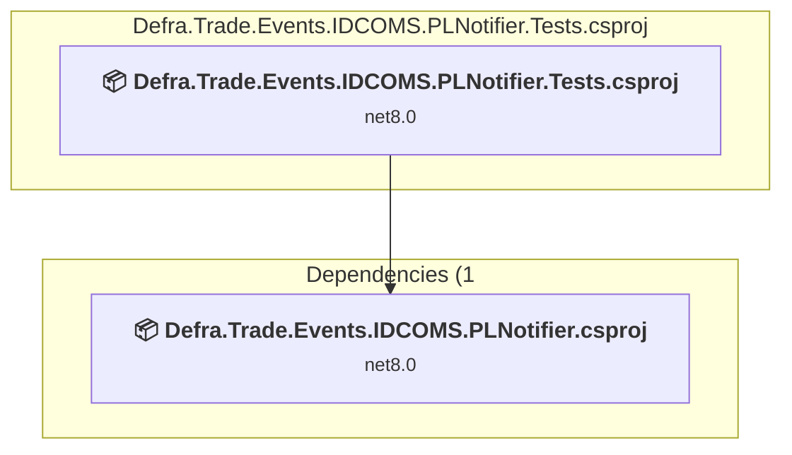

# Projects and dependencies analysis

This document provides a comprehensive overview of the projects and their dependencies in the context of upgrading to .NETCoreApp,Version=v10.0.

## Table of Contents

- [Executive Summary](#executive-Summary)
  - [Highlevel Metrics](#highlevel-metrics)
  - [Projects Compatibility](#projects-compatibility)
  - [Package Compatibility](#package-compatibility)
  - [API Compatibility](#api-compatibility)
- [Aggregate NuGet packages details](#aggregate-nuget-packages-details)
- [Top API Migration Challenges](#top-api-migration-challenges)
  - [Technologies and Features](#technologies-and-features)
  - [Most Frequent API Issues](#most-frequent-api-issues)
- [Projects Relationship Graph](#projects-relationship-graph)
- [Project Details](#project-details)

  - [src\Defra.Trade.Events.IDCOMS.PLNotifier.Application\Defra.Trade.Events.IDCOMS.PLNotifier.Application.csproj](#srcdefratradeeventsidcomsplnotifierapplicationdefratradeeventsidcomsplnotifierapplicationcsproj)
  - [src\Defra.Trade.Events.IDCOMS.PLNotifier\Defra.Trade.Events.IDCOMS.PLNotifier.csproj](#srcdefratradeeventsidcomsplnotifierdefratradeeventsidcomsplnotifiercsproj)
  - [tst\Defra.Trade.Events.IDCOMS.PLNotifier.Application.Tests\Defra.Trade.Events.IDCOMS.PLNotifier.Application.Tests.csproj](#tstdefratradeeventsidcomsplnotifierapplicationtestsdefratradeeventsidcomsplnotifierapplicationtestscsproj)
  - [tst\Defra.Trade.Events.IDCOMS.PLNotifier.Tests\Defra.Trade.Events.IDCOMS.PLNotifier.Tests.csproj](#tstdefratradeeventsidcomsplnotifiertestsdefratradeeventsidcomsplnotifiertestscsproj)

## Executive Summary

### Highlevel Metrics

| Metric | Count | Status |
| :--- | :---: | :--- |
| Total Projects | 4 | All require upgrade |
| Total NuGet Packages | 14 | 1 need upgrade |
| Total Code Files | 36 |  |
| Total Code Files with Incidents | 9 |  |
| Total Lines of Code | 1942 |  |
| Total Number of Issues | 23 |  |
| Estimated LOC to modify | 14+ | at least 0.7% of codebase |

### Projects Compatibility

| Project | Target Framework | Difficulty | Package Issues | API Issues | Est. LOC Impact | Description |
| :--- | :---: | :---: | :---: | :---: | :---: | :--- |
| [src\Defra.Trade.Events.IDCOMS.PLNotifier.Application\Defra.Trade.Events.IDCOMS.PLNotifier.Application.csproj](#srcdefratradeeventsidcomsplnotifierapplicationdefratradeeventsidcomsplnotifierapplicationcsproj) | net8.0 | 🟢 Low | 0 | 0 |  | ClassLibrary, Sdk Style = True |
| [src\Defra.Trade.Events.IDCOMS.PLNotifier\Defra.Trade.Events.IDCOMS.PLNotifier.csproj](#srcdefratradeeventsidcomsplnotifierdefratradeeventsidcomsplnotifiercsproj) | net8.0 | 🟢 Low | 2 | 3 | 3+ | ClassLibrary, Sdk Style = True |
| [tst\Defra.Trade.Events.IDCOMS.PLNotifier.Application.Tests\Defra.Trade.Events.IDCOMS.PLNotifier.Application.Tests.csproj](#tstdefratradeeventsidcomsplnotifierapplicationtestsdefratradeeventsidcomsplnotifierapplicationtestscsproj) | net8.0 | 🟢 Low | 1 | 0 |  | DotNetCoreApp, Sdk Style = True |
| [tst\Defra.Trade.Events.IDCOMS.PLNotifier.Tests\Defra.Trade.Events.IDCOMS.PLNotifier.Tests.csproj](#tstdefratradeeventsidcomsplnotifiertestsdefratradeeventsidcomsplnotifiertestscsproj) | net8.0 | 🟢 Low | 1 | 11 | 11+ | DotNetCoreApp, Sdk Style = True |

### Package Compatibility

| Status | Count | Percentage |
| :--- | :---: | :---: |
| ✅ Compatible | 13 | 92.9% |
| ⚠️ Incompatible | 1 | 7.1% |
| 🔄 Upgrade Recommended | 0 | 0.0% |
| ***Total NuGet Packages*** | ***14*** | ***100%*** |

### API Compatibility

| Category | Count | Impact |
| :--- | :---: | :--- |
| 🔴 Binary Incompatible | 3 | High - Require code changes |
| 🟡 Source Incompatible | 5 | Medium - Needs re-compilation and potential conflicting API error fixing |
| 🔵 Behavioral change | 6 | Low - Behavioral changes that may require testing at runtime |
| ✅ Compatible | 3189 |  |
| ***Total APIs Analyzed*** | ***3203*** |  |

## Aggregate NuGet packages details

| Package | Current Version | Suggested Version | Projects | Description |
| :--- | :---: | :---: | :--- | :--- |
| AutoFixture | 4.18.1 |  | [Defra.Trade.Events.IDCOMS.PLNotifier.Application.Tests.csproj](#tstdefratradeeventsidcomsplnotifierapplicationtestsdefratradeeventsidcomsplnotifierapplicationtestscsproj) [Defra.Trade.Events.IDCOMS.PLNotifier.Tests.csproj](#tstdefratradeeventsidcomsplnotifiertestsdefratradeeventsidcomsplnotifiertestscsproj) | ✅Compatible |
| coverlet.collector | 6.0.2 |  | [Defra.Trade.Events.IDCOMS.PLNotifier.Application.Tests.csproj](#tstdefratradeeventsidcomsplnotifierapplicationtestsdefratradeeventsidcomsplnotifierapplicationtestscsproj) [Defra.Trade.Events.IDCOMS.PLNotifier.Tests.csproj](#tstdefratradeeventsidcomsplnotifiertestsdefratradeeventsidcomsplnotifiertestscsproj) | ✅Compatible |
| Defra.Trade.Common | 4.0.2 |  | [Defra.Trade.Events.IDCOMS.PLNotifier.csproj](#srcdefratradeeventsidcomsplnotifierdefratradeeventsidcomsplnotifiercsproj) | ✅Compatible |
| Defra.Trade.Common.Function.Health | 4.0.6 |  | [Defra.Trade.Events.IDCOMS.PLNotifier.Application.csproj](#srcdefratradeeventsidcomsplnotifierapplicationdefratradeeventsidcomsplnotifierapplicationcsproj) | ✅Compatible |
| Defra.Trade.Common.Logging | 2.0.13 |  | [Defra.Trade.Events.IDCOMS.PLNotifier.csproj](#srcdefratradeeventsidcomsplnotifierdefratradeeventsidcomsplnotifiercsproj) | ✅Compatible |
| Defra.Trade.Crm | 4.0.0 |  | [Defra.Trade.Events.IDCOMS.PLNotifier.Application.csproj](#srcdefratradeeventsidcomsplnotifierapplicationdefratradeeventsidcomsplnotifierapplicationcsproj) | ✅Compatible |
| FakeItEasy | 8.3.0 |  | [Defra.Trade.Events.IDCOMS.PLNotifier.Application.Tests.csproj](#tstdefratradeeventsidcomsplnotifierapplicationtestsdefratradeeventsidcomsplnotifierapplicationtestscsproj) [Defra.Trade.Events.IDCOMS.PLNotifier.Tests.csproj](#tstdefratradeeventsidcomsplnotifiertestsdefratradeeventsidcomsplnotifiertestscsproj) | ✅Compatible |
| Microsoft.Azure.Functions.Worker | 1.23.0 |  | [Defra.Trade.Events.IDCOMS.PLNotifier.Tests.csproj](#tstdefratradeeventsidcomsplnotifiertestsdefratradeeventsidcomsplnotifiertestscsproj) | ✅Compatible |
| Microsoft.Azure.WebJobs.Extensions.ServiceBus | 5.16.4 |  | [Defra.Trade.Events.IDCOMS.PLNotifier.csproj](#srcdefratradeeventsidcomsplnotifierdefratradeeventsidcomsplnotifiercsproj) | NuGet package functionality is included with framework reference |
| Microsoft.NET.Sdk.Functions | 4.4.1 |  | [Defra.Trade.Events.IDCOMS.PLNotifier.csproj](#srcdefratradeeventsidcomsplnotifierdefratradeeventsidcomsplnotifiercsproj) | Needs to be replaced with Replace with new package Microsoft.Azure.Functions.Worker.Extensions.Http=3.3.0;Microsoft.Azure.Functions.Worker.Sdk=2.0.7;Microsoft.Azure.Functions.Worker=2.52.0 |
| Microsoft.NET.Test.Sdk | 17.11.0 |  | [Defra.Trade.Events.IDCOMS.PLNotifier.Application.Tests.csproj](#tstdefratradeeventsidcomsplnotifierapplicationtestsdefratradeeventsidcomsplnotifierapplicationtestscsproj) [Defra.Trade.Events.IDCOMS.PLNotifier.Tests.csproj](#tstdefratradeeventsidcomsplnotifiertestsdefratradeeventsidcomsplnotifiertestscsproj) | ✅Compatible |
| Shouldly | 4.2.1 |  | [Defra.Trade.Events.IDCOMS.PLNotifier.Application.Tests.csproj](#tstdefratradeeventsidcomsplnotifierapplicationtestsdefratradeeventsidcomsplnotifierapplicationtestscsproj) [Defra.Trade.Events.IDCOMS.PLNotifier.Tests.csproj](#tstdefratradeeventsidcomsplnotifiertestsdefratradeeventsidcomsplnotifiertestscsproj) | ✅Compatible |
| xunit | 2.9.0 |  | [Defra.Trade.Events.IDCOMS.PLNotifier.Application.Tests.csproj](#tstdefratradeeventsidcomsplnotifierapplicationtestsdefratradeeventsidcomsplnotifierapplicationtestscsproj) [Defra.Trade.Events.IDCOMS.PLNotifier.Tests.csproj](#tstdefratradeeventsidcomsplnotifiertestsdefratradeeventsidcomsplnotifiertestscsproj) | ⚠️NuGet package is deprecated |
| xunit.runner.visualstudio | 2.8.2 |  | [Defra.Trade.Events.IDCOMS.PLNotifier.Application.Tests.csproj](#tstdefratradeeventsidcomsplnotifierapplicationtestsdefratradeeventsidcomsplnotifierapplicationtestscsproj) [Defra.Trade.Events.IDCOMS.PLNotifier.Tests.csproj](#tstdefratradeeventsidcomsplnotifiertestsdefratradeeventsidcomsplnotifiertestscsproj) | ✅Compatible |

## Top API Migration Challenges

### Technologies and Features

| Technology | Issues | Percentage | Migration Path |
| :--- | :---: | :---: | :--- |

### Most Frequent API Issues

| API | Count | Percentage | Category |
| :--- | :---: | :---: | :--- |
| T:System.Uri | 4 | 28.6% | Behavioral Change |
| T:Microsoft.Extensions.DependencyInjection.ServiceCollectionExtensions | 2 | 14.3% | Binary Incompatible |
| M:System.TimeSpan.FromSeconds(System.Double) | 2 | 14.3% | Source Incompatible |
| M:System.Uri.#ctor(System.String) | 2 | 14.3% | Behavioral Change |
| T:System.BinaryData | 2 | 14.3% | Source Incompatible |
| M:Microsoft.Extensions.DependencyInjection.OptionsConfigurationServiceCollectionExtensions.Configure''1(Microsoft.Extensions.DependencyInjection.IServiceCollection,Microsoft.Extensions.Configuration.IConfiguration) | 1 | 7.1% | Binary Incompatible |
| M:System.BinaryData.FromString(System.String) | 1 | 7.1% | Source Incompatible |

## Projects Relationship Graph

Legend:
📦 SDK-style project
⚙️ Classic project

## Project Details

### src\Defra.Trade.Events.IDCOMS.PLNotifier.Application\Defra.Trade.Events.IDCOMS.PLNotifier.Application.csproj

#### Project Info

- **Current Target Framework:** net8.0
- **Proposed Target Framework:** net10.0
- **SDK-style**: True
- **Project Kind:** ClassLibrary
- **Dependencies**: 0
- **Dependants**: 2
- **Number of Files**: 17
- **Number of Files with Incidents**: 1
- **Lines of Code**: 513
- **Estimated LOC to modify**: 0+ (at least 0.0% of the project)

#### Dependency Graph

Legend:
📦 SDK-style project
⚙️ Classic project

### API Compatibility

| Category | Count | Impact |
| :--- | :---: | :--- |
| 🔴 Binary Incompatible | 0 | High - Require code changes |
| 🟡 Source Incompatible | 0 | Medium - Needs re-compilation and potential conflicting API error fixing |
| 🔵 Behavioral change | 0 | Low - Behavioral changes that may require testing at runtime |
| ✅ Compatible | 1078 |  |
| ***Total APIs Analyzed*** | ***1078*** |  |

### src\Defra.Trade.Events.IDCOMS.PLNotifier\Defra.Trade.Events.IDCOMS.PLNotifier.csproj

#### Project Info

- **Current Target Framework:** net8.0
- **Proposed Target Framework:** net10.0
- **SDK-style**: True
- **Project Kind:** ClassLibrary
- **Dependencies**: 1
- **Dependants**: 1
- **Number of Files**: 6
- **Number of Files with Incidents**: 3
- **Lines of Code**: 298
- **Estimated LOC to modify**: 3+ (at least 1.0% of the project)

#### Dependency Graph

Legend:
📦 SDK-style project
⚙️ Classic project

### API Compatibility

| Category | Count | Impact |
| :--- | :---: | :--- |
| 🔴 Binary Incompatible | 3 | High - Require code changes |
| 🟡 Source Incompatible | 0 | Medium - Needs re-compilation and potential conflicting API error fixing |
| 🔵 Behavioral change | 0 | Low - Behavioral changes that may require testing at runtime |
| ✅ Compatible | 332 |  |
| ***Total APIs Analyzed*** | ***335*** |  |

### tst\Defra.Trade.Events.IDCOMS.PLNotifier.Application.Tests\Defra.Trade.Events.IDCOMS.PLNotifier.Application.Tests.csproj

#### Project Info

- **Current Target Framework:** net8.0
- **Proposed Target Framework:** net10.0
- **SDK-style**: True
- **Project Kind:** DotNetCoreApp
- **Dependencies**: 1
- **Dependants**: 0
- **Number of Files**: 9
- **Number of Files with Incidents**: 1
- **Lines of Code**: 712
- **Estimated LOC to modify**: 0+ (at least 0.0% of the project)

#### Dependency Graph

Legend:
📦 SDK-style project
⚙️ Classic project

### API Compatibility

| Category | Count | Impact |
| :--- | :---: | :--- |
| 🔴 Binary Incompatible | 0 | High - Require code changes |
| 🟡 Source Incompatible | 0 | Medium - Needs re-compilation and potential conflicting API error fixing |
| 🔵 Behavioral change | 0 | Low - Behavioral changes that may require testing at runtime |
| ✅ Compatible | 985 |  |
| ***Total APIs Analyzed*** | ***985*** |  |

### tst\Defra.Trade.Events.IDCOMS.PLNotifier.Tests\Defra.Trade.Events.IDCOMS.PLNotifier.Tests.csproj

#### Project Info

- **Current Target Framework:** net8.0
- **Proposed Target Framework:** net10.0
- **SDK-style**: True
- **Project Kind:** DotNetCoreApp
- **Dependencies**: 1
- **Dependants**: 0
- **Number of Files**: 8
- **Number of Files with Incidents**: 4
- **Lines of Code**: 419
- **Estimated LOC to modify**: 11+ (at least 2.6% of the project)

#### Dependency Graph

Legend:
📦 SDK-style project
⚙️ Classic project

### API Compatibility

| Category | Count | Impact |
| :--- | :---: | :--- |
| 🔴 Binary Incompatible | 0 | High - Require code changes |
| 🟡 Source Incompatible | 5 | Medium - Needs re-compilation and potential conflicting API error fixing |
| 🔵 Behavioral change | 6 | Low - Behavioral changes that may require testing at runtime |
| ✅ Compatible | 794 |  |
| ***Total APIs Analyzed*** | ***805*** |  |

